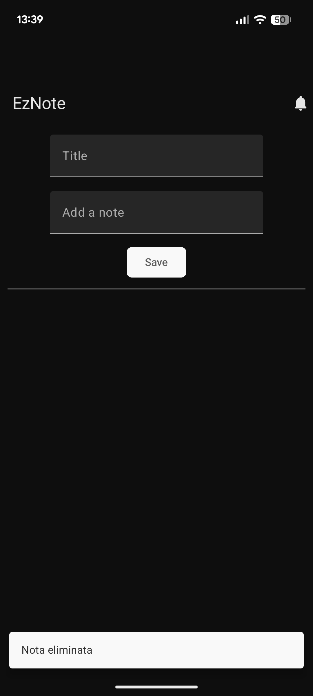
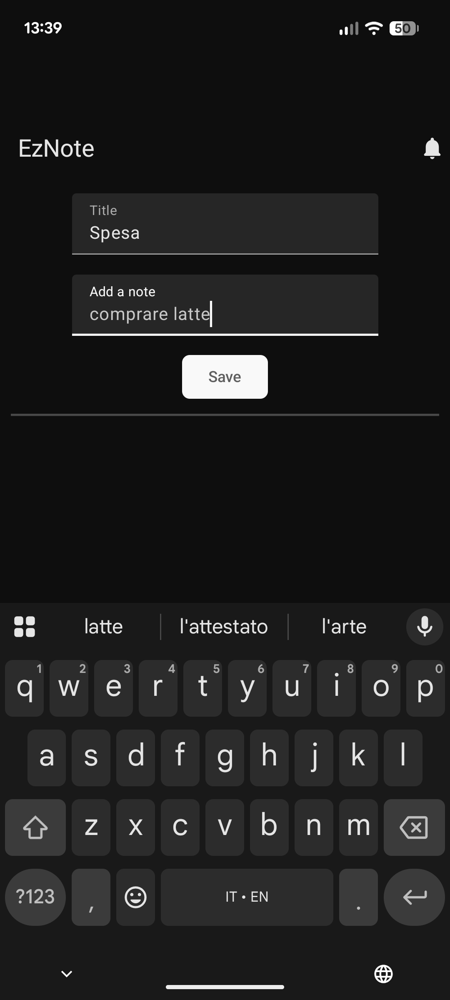
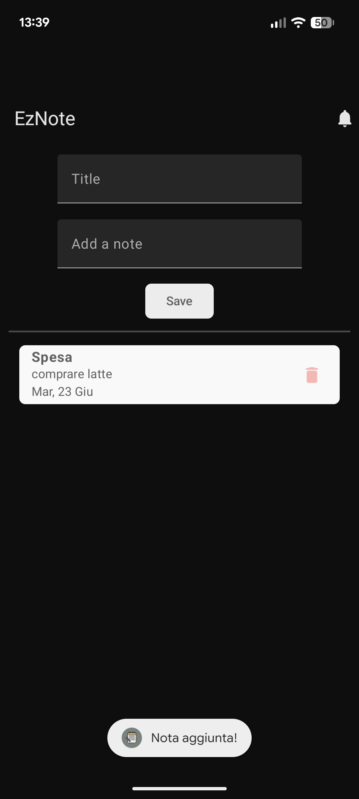
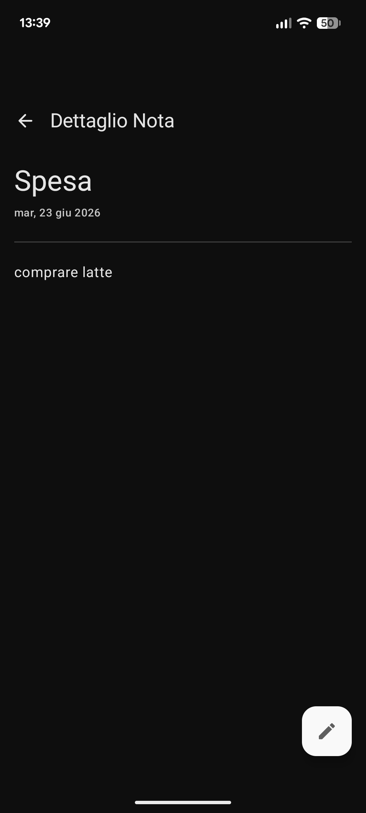
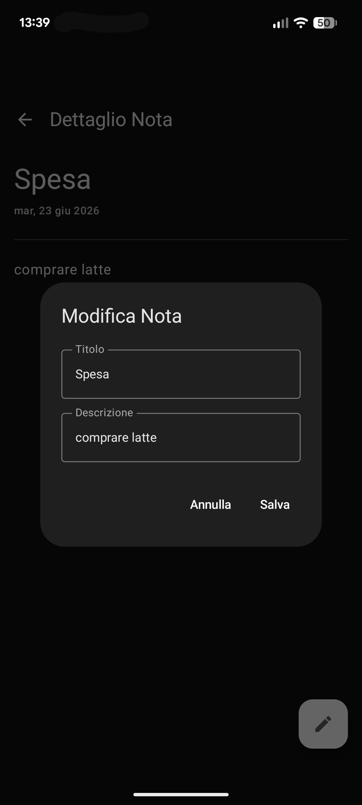

# 📝 EzNote

A modern, offline-first Android application for managing daily notes. Built entirely with the latest Android development standards, showcasing a reactive UI and a clean architectural approach.

## ✨ Key Features
* **Create, Read, Update, Delete (CRUD):** Full management of personal notes.
* **Offline-First:** Data is securely stored locally on the device, ensuring the app works flawlessly without an internet connection.
* **Reactive UI:** The interface automatically updates in real-time as the underlying data changes, providing a seamless user experience.
* **Modern UI Design:** Built completely without XML, utilizing a declarative UI approach.

## 🛠️ Tech Stack & Architecture
This project implements the **MVVM (Model-View-ViewModel)** architecture to ensure a clear separation of concerns and highly maintainable code.

* **Language:** Kotlin
* **UI Toolkit:** Jetpack Compose (Declarative UI)
* **Local Database:** Room (SQLite abstraction)
* **Dependency Injection:** Dagger Hilt
* **Asynchronous Programming:** Kotlin Coroutines & Flow

## 🚀 How to run the project
1. Clone the repository:
   ```bash
   git clone [https://github.com/emanuele400tt/note-app.git](https://github.com/emanuele400tt/note-app.git)
2. Open the project in Android Studio.

3. Allow Gradle to sync the dependencies.

4. Run the app on an emulator or a physical device.

## App Preview
## 📱 Screenshot

| Home screen | Adding note | Note added | 
| :---: | :---: | :---: | 
|  
|  
|  
| Note details | Note editing | Note deleted |
| :---: | :---: | :---: | 
|  
|  
|  | 

## Versione Italiana

Un'applicazione Android moderna e "offline-first" per la gestione delle note quotidiane. Sviluppata utilizzando esclusivamente i più recenti standard di sviluppo Android, per dimostrare l'uso di interfacce reattive e un approccio architetturale pulito.
## ✨ Funzionalità Principali

* **Operazioni CRUD: Creazione, lettura, aggiornamento ed eliminazione delle note.

* **Offline-First: I dati vengono salvati localmente sul dispositivo in modo sicuro, garantendo il funzionamento dell'app anche senza connessione internet.

* **Interfaccia Reattiva: La UI si aggiorna automaticamente in tempo reale in base alle modifiche dei dati sottostanti, offrendo un'esperienza utente fluida.

* **Design Moderno: Costruita interamente senza l'uso di XML, sfruttando un approccio UI dichiarativo.

## 🛠️ Stack Tecnologico e Architettura

Il progetto implementa l'architettura MVVM (Model-View-ViewModel) per garantire una netta separazione delle responsabilità e un codice facilmente manutenibile.

* **Linguaggio: Kotlin

* **UI Toolkit: Jetpack Compose (UI Dichiarativa)

* **Database Locale: Room

* **Dependency Injection: Dagger Hilt

* **Programmazione Asincrona: Kotlin Coroutines & Flow

## 🚀 Come lanciare il progetto

1. Clonare il repository:
    ```bash
    git clone [https://github.com/emanuele400tt/note-app.git](https://github.com/emanuele400tt/note-app.git)

2. Aprire il progetto in Android Studio.

3. Attendere la sincronizzazione di Gradle.

4. Avviare l'app su un emulatore o un dispositivo fisico.
